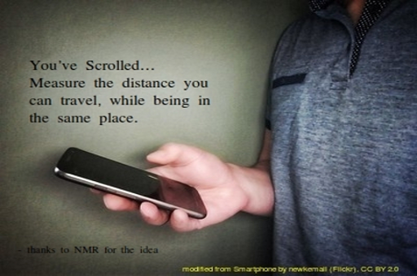

### You Scrolled App

We scroll *a LOT* nowadays. Your fingers do a lot of travelling, and yes, it's hard work. 
**You scrolled** helps you  quantify the distance your poor fingers travel. Move your finger
on the screen and watch as the distance it's travelled is shown on the screen. Thanks to NMR for the idea!

The app was made possible by the [Kivy](https://kivy.org/#home) framework! 

#### Installation
* Go to the ```bin/``` folder and download the .apk file using your Android phone 
* You will need to enable installation from unknown sources. Check [here](https://developer.android.com/studio/publish#unknown-sources) 
* If the instructions in the link above don't seem to match with what's on your phone, [Google]() up the instructions for your particular model.

Let me know how you liked the app. Ping me by email (thejasvib@gmail.com), Twitter (@BeleyurThejasvi) or yell out your feelings from a safe distance. 

#### Image Credits 
The pre-splash and icon image is by  newkemall (Flickr), and has been modified . The original photo was released under a 
CC BY 2.0 license (https://creativecommons.org/licenses/by/2.0/)

#### License 
Copyright <2020> <Thejasvi Beleyur>

Permission is hereby granted, free of charge, to any person obtaining a copy of this software and associated documentation files (the "Software"), to deal in the Software without restriction, including without limitation the rights to use, copy, modify, merge, publish, distribute, sublicense, and/or sell copies of the Software, and to permit persons to whom the Software is furnished to do so, subject to the following conditions:

The above copyright notice and this permission notice shall be included in all copies or substantial portions of the Software.

THE SOFTWARE IS PROVIDED "AS IS", WITHOUT WARRANTY OF ANY KIND, EXPRESS OR IMPLIED, INCLUDING BUT NOT LIMITED TO THE WARRANTIES OF MERCHANTABILITY, FITNESS FOR A PARTICULAR PURPOSE AND NONINFRINGEMENT. IN NO EVENT SHALL THE AUTHORS OR COPYRIGHT HOLDERS BE LIABLE FOR ANY CLAIM, DAMAGES OR OTHER LIABILITY, WHETHER IN AN ACTION OF CONTRACT, TORT OR OTHERWISE, ARISING FROM, OUT OF OR IN CONNECTION WITH THE SOFTWARE OR THE USE OR OTHER DEALINGS IN THE SOFTWARE.

